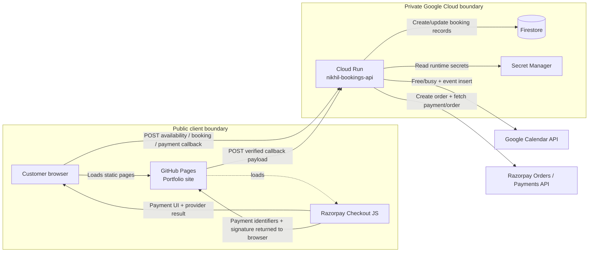
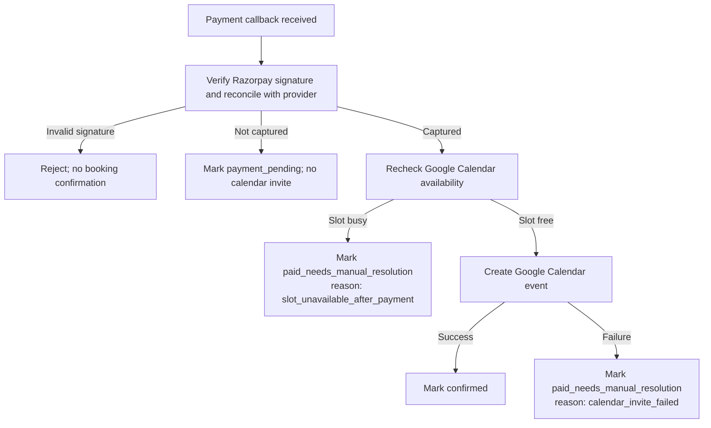

# Booking, payment, and calendar architecture

This document explains how the direct-session booking flow was built for the static portfolio site, excluding the unrelated HTML/CSS/static portfolio pages. It is intended as a rebuild guide from the current static page reference.

## Goals

- Keep the public website static and dependency-free so GitHub Pages can serve it from `main` / repository root.
- Keep Google Calendar credentials, Razorpay keys, payment verification, and booking persistence on the server only.
- Show real available slots from Google Calendar before payment.
- Confirm a booking only after Razorpay reports a captured payment and the server verifies it.
- Send the customer a Google Calendar invitation after verified payment.
- Avoid fake forms, browser-trusted payment state, trackers, cookies, or exposed secrets.

## High-level architecture



## Main components

| Component | Runs where | Responsibility |
|---|---|---|
| `index.html` booking section | GitHub Pages | Service picker, date/time picker, customer name/email fields, Razorpay Checkout launch. |
| `assets/booking.js` | Browser | UI state, client-side validation, availability lookup, booking-intent request, payment-callback request. |
| `assets/booking-api-client.js` | Browser | Safe wrapper for `/api/bookings/intent` and `/api/payments/checkout-callback`. |
| `assets/availability-client.js` | Browser | Safe wrapper for `/api/availability`. |
| `assets/booking-slots.js` | Browser and server | Shared IST slot generation and selected-slot validation. |
| `integrations/calendar/availability-server.mjs` | Cloud Run | HTTP server, CORS, JSON parsing, route dispatch, startup validation. |
| `integrations/calendar/availability.mjs` | Cloud Run | Google Calendar free/busy lookup and slot filtering. |
| `integrations/calendar/booking-service.mjs` | Cloud Run | Booking intent, payment verification, final availability recheck, Firestore update, Calendar invite creation. |
| `integrations/calendar/google-oauth.mjs` | Cloud Run / local OAuth helper | OAuth token refresh, owner verification, free/busy calls, event insertion. |
| `integrations/razorpay/api-client.mjs` | Cloud Run | Razorpay order creation, checkout options, signature verification, provider reconciliation. |
| `integrations/razorpay/payment-model.mjs` | Cloud Run / tests | Service catalog, amount validation, payment state transitions, webhook signature verification. |
| `integrations/calendar/deploy-cloud-run-bookings.sh` | Cloud Shell | Builds an allowlisted backend bundle and deploys Cloud Run. |

## Low-level design

### Public endpoints

| Endpoint | Method | Purpose |
|---|---|---|
| `/healthz` | `GET` | Cloud Run health check. |
| `/api/availability` | `POST` | Returns available IST slots for a service/date after checking Google Calendar. |
| `/api/bookings/intent` | `POST` | Validates customer input, rechecks availability, creates a booking record, creates a Razorpay order, and returns Checkout options. |
| `/api/payments/checkout-callback` | `POST` | Verifies Razorpay Checkout callback, reconciles payment/order with Razorpay, rechecks the slot, then creates the Calendar invite if payment is captured. |
| `/api/razorpay/webhook` | `POST` | Optional provider webhook reconciliation for payment status updates. |

### Booking states

| State | Meaning |
|---|---|
| `payment_created` | A booking intent and Razorpay order exist, but no verified captured payment yet. |
| `payment_pending` | Razorpay returned a valid payment, but it is not captured yet. No calendar invite is created. |
| `confirmed` | Payment is captured, final availability recheck passed, and a Google Calendar event was created. |
| `paid_needs_manual_resolution` | Payment is captured but the slot became unavailable or the Calendar invite could not be created. Manual follow-up is required. |
| `payment_failed` / provider-specific failed states | Razorpay reported failure/cancellation/refund-like state. No calendar invite is created. |

Creating a booking intent places a 15-minute server-side hold on the selected slot. A second checkout for that slot is rejected before another Razorpay order is created. Confirmed bookings and captured payments awaiting manual resolution continue to claim the slot until they are resolved.

### Firestore record shape

The booking store persists one document per booking ID. Key fields:

```json
{
  "bookingId": "bk_...",
  "status": "payment_created",
  "serviceId": "mentorship",
  "serviceName": "Mentorship",
  "customerName": "Test User",
  "customerEmail": "test@example.com",
  "date": "2026-09-19",
  "time": "17:30",
  "slot": {
    "start": "2026-09-19T12:00:00.000Z",
    "end": "2026-09-19T12:30:00.000Z"
  },
  "order": {
    "orderId": "order_...",
    "amountPaise": 100,
    "currency": "INR"
  },
  "payment": {
    "paymentId": "pay_...",
    "status": "captured",
    "captured": true
  },
  "calendarEvent": {
    "eventId": "event_...",
    "eventLink": "https://calendar.google.com/..."
  }
}
```

## Successful booking sequence

```mermaid
sequenceDiagram
  autonumber
  participant U as Customer
  participant P as GitHub Pages UI
  participant A as Cloud Run API
  participant G as Google Calendar
  participant F as Firestore
  participant R as Razorpay

  U->>P: Select service, date, time, name, email
  P->>A: POST /api/availability
  A->>G: freebusy.query booking calendar + primary calendar
  G-->>A: Busy windows
  A-->>P: Available slots
  P->>A: POST /api/bookings/intent
  A->>A: Validate date, slot, name, email, amount
  A->>G: Final pre-payment free/busy check
  A->>R: Create Razorpay order
  A->>F: Create booking: payment_created
  A-->>P: Checkout options
  P->>R: Open Razorpay Checkout
  R-->>P: payment_id + order_id + signature
  P->>A: POST /api/payments/checkout-callback
  A->>R: Verify signature and reconcile payment/order
  R-->>A: Captured payment details
  A->>G: Final post-payment free/busy check
  A->>G: Insert Calendar event with attendee
  G-->>A: Event ID/link; Google sends invite email
  A->>F: Update booking: confirmed
  A-->>P: Confirmed booking response
```

## Failure and manual-resolution flow



## Razorpay setup

1. Create or use a Razorpay account.
2. Start in **Test mode** for end-to-end validation.
3. Copy the matching test credentials:
   - `rzp_test_...` key ID
   - key secret
4. Store them in Google Secret Manager:

```bash
printf '%s' 'rzp_test_xxxxx' | gcloud secrets versions add razorpay-key-id --data-file=-
printf '%s' 'test_key_secret_here' | gcloud secrets versions add razorpay-key-secret --data-file=-
printf '%s' 'webhook_secret_here' | gcloud secrets versions add razorpay-webhook-secret --data-file=-
```

5. If using webhooks, configure Razorpay to call:

```text
https://nikhil-bookings-api-otzn3ne7rq-el.a.run.app/api/razorpay/webhook
```

6. Subscribe to payment/order events needed for reconciliation, such as payment captured, payment failed, and order paid.
7. Keep test and live keys separate. A Checkout key beginning with `rzp_test_` means the payment is in Razorpay test mode; it can show “success” without real money movement.

Razorpay INR orders require a minimum amount of ₹1.00, represented as `100` paise. ₹0.50 is below the supported minimum for INR Orders API payments.

## Google Cloud setup

### Project and APIs

Project:

```bash
gcloud config set project portfolio-bookings
```

Enable APIs:

```bash
gcloud services enable \
  run.googleapis.com \
  cloudbuild.googleapis.com \
  secretmanager.googleapis.com \
  firestore.googleapis.com \
  calendar-json.googleapis.com
```

### Runtime service account

```bash
gcloud iam service-accounts create nikhil-bookings-runtime \
  --display-name="Nikhil bookings runtime"
```

Grant only the access required by the service:

```bash
PROJECT_ID="portfolio-bookings"
RUNTIME_SA="nikhil-bookings-runtime@$PROJECT_ID.iam.gserviceaccount.com"

gcloud projects add-iam-policy-binding "$PROJECT_ID" \
  --member="serviceAccount:$RUNTIME_SA" \
  --role="roles/datastore.user"

gcloud projects add-iam-policy-binding "$PROJECT_ID" \
  --member="serviceAccount:$RUNTIME_SA" \
  --role="roles/secretmanager.secretAccessor"
```

### Firestore

Create a Firestore database in Native mode. The code defaults to the default database. If a custom database is used, set `FIRESTORE_DATABASE_ID`.

### Secret Manager

Required secrets:

| Secret | Purpose |
|---|---|
| `nikhil-calendar-runtime` | Runtime Google OAuth token bundle for Calendar free/busy and event creation. Mounted as a file. |
| `razorpay-key-id` | Razorpay public key ID used by Checkout options. |
| `razorpay-key-secret` | Razorpay private key secret used only on the server. |
| `razorpay-webhook-secret` | Razorpay webhook HMAC secret. |

## Google Calendar OAuth setup

The backend uses a user-authorized Google Calendar token because it needs to read availability and create events on Nikhil’s calendar.

Required scopes:

```text
openid
email
https://www.googleapis.com/auth/calendar.events.freebusy
https://www.googleapis.com/auth/calendar.events
```

Important details:

- The OAuth credential must use the owner email expected by the backend.
- The OAuth token must be regenerated after adding `calendar.events`; an older free/busy-only token can read availability but cannot create invites.
- Calendar event creation uses `sendUpdates=all`, so Google Calendar is responsible for sending attendee email notifications.
- If the attendee email is the same as the calendar owner/organizer, Google may add the event to the calendar without sending a separate invitation email to the same inbox.

## Deployment

Deploy only the backend allowlist bundle, not the entire repository:

```bash
cd ~/nikhil-kumar-portfolio
git pull
bash integrations/calendar/deploy-cloud-run-bookings.sh
```

Expected bundle:

```text
./assets/booking-slots.js
./Dockerfile
./integrations/calendar/availability.mjs
./integrations/calendar/availability-server.mjs
./integrations/calendar/booking-service.mjs
./integrations/calendar/google-oauth.mjs
./integrations/razorpay/api-client.mjs
./integrations/razorpay/payment-model.mjs
```

If deployment output says “Building using Buildpacks,” the wrong source folder was used. The correct deploy uses the generated Dockerfile bundle.

## Test cURLs

Set the service URL:

```bash
SERVICE_URL="https://nikhil-bookings-api-otzn3ne7rq-el.a.run.app"
```

Health:

```bash
curl -i "$SERVICE_URL/healthz"
```

Availability:

```bash
curl -i -X POST "$SERVICE_URL/api/availability" \
  -H 'Origin: https://cracker-jack.github.io' \
  -H 'Content-Type: application/json' \
  -d '{"serviceId":"mentorship","date":"2026-09-19"}'
```

Expected after the ₹1 test-price deployment:

```json
{
  "service": {
    "id": "mentorship",
    "priceInr": 1
  }
}
```

Create booking intent:

```bash
curl -i -X POST "$SERVICE_URL/api/bookings/intent" \
  -H 'Origin: https://cracker-jack.github.io' \
  -H 'Content-Type: application/json' \
  -d '{"serviceId":"mentorship","date":"2026-09-19","time":"17:30","customerName":"Test User","customerEmail":"test@example.com"}'
```

Expected after the ₹1 test-price deployment:

```json
{
  "booking": {
    "status": "payment_created"
  },
  "checkout": {
    "amount": 100,
    "currency": "INR"
  }
}
```

Past date validation:

```bash
curl -i -X POST "$SERVICE_URL/api/bookings/intent" \
  -H 'Origin: https://cracker-jack.github.io' \
  -H 'Content-Type: application/json' \
  -d '{"serviceId":"mentorship","date":"2020-01-01","time":"17:30","customerName":"Test User","customerEmail":"test@example.com"}'
```

Expected:

```json
{"error":"invalid_date"}
```

Email validation:

```bash
curl -i -X POST "$SERVICE_URL/api/bookings/intent" \
  -H 'Origin: https://cracker-jack.github.io' \
  -H 'Content-Type: application/json' \
  -d '{"serviceId":"mentorship","date":"2026-09-19","time":"17:30","customerName":"Test User","customerEmail":"bad@example"}'
```

Expected:

```json
{"error":"invalid_email"}
```

Blocked slot:

```bash
curl -i -X POST "$SERVICE_URL/api/bookings/intent" \
  -H 'Origin: https://cracker-jack.github.io' \
  -H 'Content-Type: application/json' \
  -d '{"serviceId":"mentorship","date":"2026-09-19","time":"16:00","customerName":"Test User","customerEmail":"test@example.com"}'
```

Expected when that slot is busy:

```json
{"error":"slot_unavailable"}
```

Bad browser origin:

```bash
curl -i -X POST "$SERVICE_URL/api/bookings/intent" \
  -H 'Origin: https://attacker.example' \
  -H 'Content-Type: application/json' \
  -d '{"serviceId":"mentorship","date":"2026-09-19","time":"17:30","customerName":"Test User","customerEmail":"test@example.com"}'
```

Expected:

```json
{"error":"origin_not_allowed"}
```

The real `/api/payments/checkout-callback` request requires a Razorpay-generated payment ID, order ID, and signature, so do not hand-write a fake success callback for production validation. Use the browser Checkout flow or local automated tests for callback behavior.

## Local validation

From the repository root on Windows:

```powershell
node --test --test-reporter=dot .\integrations\calendar\*.test.mjs .\integrations\razorpay\*.test.mjs
```

## Troubleshooting

### Payment says success but no email arrives

Razorpay Checkout success means the Razorpay UI completed a provider flow. The booking is only final when the backend verifies the callback, confirms the payment is captured, rechecks availability, creates a Google Calendar event, and stores the booking as `confirmed`.

Check these in order:

1. Confirm whether Razorpay is in test mode. If the Checkout key starts with `rzp_test_`, it is test mode. Test payments can show success without real money movement.
2. Check the site after payment. A fully completed flow should show a confirmed booking message. If it shows verification failure or manual resolution, the backend did not complete the invite step.
3. If the customer email is the same as the calendar owner, Google may create the event without sending a separate invite email to that same inbox. Check Google Calendar directly.
4. Check spam/promotions folders for the attendee email.
5. Check Cloud Run logs for callback or calendar errors:

```bash
REVISION="$(gcloud run services describe nikhil-bookings-api --region asia-south1 --format='value(status.latestReadyRevisionName)')"
gcloud logging read \
  "resource.type=\"cloud_run_revision\" AND resource.labels.service_name=\"nikhil-bookings-api\" AND resource.labels.revision_name=\"$REVISION\"" \
  --limit=80 \
  --format='table(timestamp,severity,textPayload,jsonPayload.message)'
```

Relevant error clues:

| Error clue | Meaning |
|---|---|
| `invalid_signature` | Browser callback did not match Razorpay HMAC verification. |
| `payment_pending` | Payment was authorized or initiated but not captured. |
| `slot_unavailable_after_payment` | Payment was captured, but the final calendar recheck found the slot busy. |
| `calendar_invite_failed` | Payment was captured, but Calendar event creation failed. Manual follow-up is required. |
| `CALENDAR_EVENTS_SCOPE_MISSING` | OAuth token needs to be regenerated with `calendar.events`. |
| `GOOGLE_REQUEST_FAILED` | Google API returned an error; inspect status/message. |

### Cloud Run failed to start

Read latest revision and logs:

```bash
gcloud run services describe nikhil-bookings-api \
  --region asia-south1 \
  --format='yaml(status.url,status.latestReadyRevisionName,status.latestCreatedRevisionName,status.conditions)'

REVISION="$(gcloud run services describe nikhil-bookings-api --region asia-south1 --format='value(status.latestCreatedRevisionName)')"
gcloud logging read \
  "resource.type=\"cloud_run_revision\" AND resource.labels.service_name=\"nikhil-bookings-api\" AND resource.labels.revision_name=\"$REVISION\"" \
  --limit=60 \
  --format='table(timestamp,severity,textPayload,jsonPayload.message)'
```

Common causes:

- Missing copied runtime file in the Docker image.
- Placeholder Razorpay key secret such as `YOUR_RAZO...`.
- Markdown-escaped shell variables like `RAZORPAY\_KEY\_ID`; shell commands must use `RAZORPAY_KEY_ID`.
- Deploying from the wrong folder instead of the prepared allowlisted bundle.
